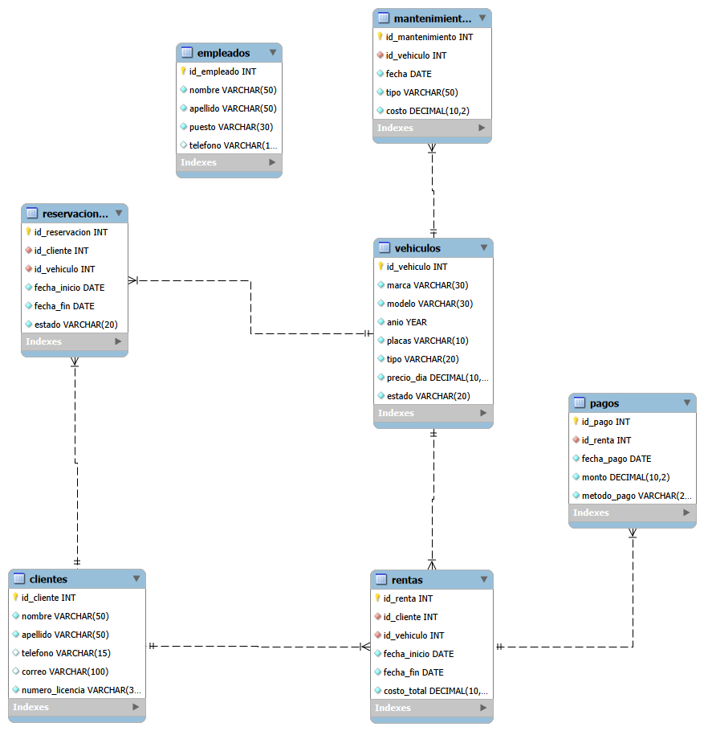

# Sistema de Control para Rentadora de Autos en Cancún 

## Descripción
Este proyecto es una base de datos diseñada para manejar una agencia de renta de autos en Cancún. 

El sistema sirve para llevar el registro de los clientes, los carros y los empleados de la agencia. 
También permite controlar todo el proceso de alquiler: desde que un cliente hace una reservación, 
hasta que se registra la renta por fechas y se guarda su pago. Además, agregamos una parte para llevar el control de los mantenimientos que se le hacen a cada vehículo.

## Diagrama Entidad-Relación (DER)
A continuación se muestra el Diagrama Entidad-Relación (DER) de la base de datos generado en MySQL Workbench:

##Colaboradores
* **Diana Patricia Malaquías Olivares** - GitHub: [@dianamalaquias](https://github.com/dianamalaquias)
* **Alberto Agustín Díaz Jiménez ** - GitHub: [@albertodiaz05](https://github.com/albertodiaz05)
